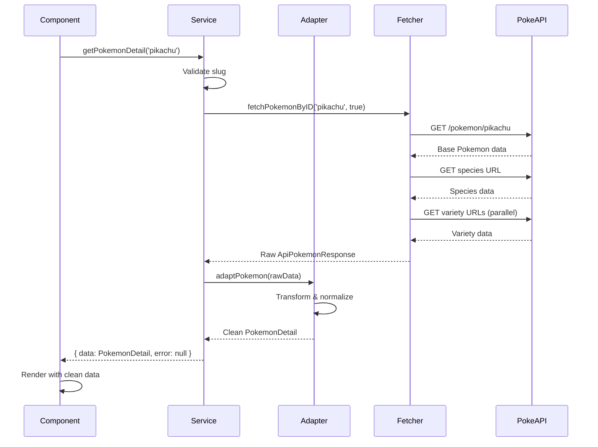

## Overview

This page traces two complete data flows through the application:

1. **Fetching Pokemon List** - Used on the home page gallery
2. **Fetching Pokemon Detail** - Used on individual Pokemon pages

Each example shows the exact code path from component to API and back.

## Example 1: Fetching Pokemon List

This flow demonstrates how the home page fetches and displays a list of Pokemon.

### Step 1: Component Calls Service

**File**: `src/app/page.tsx:19-22`

```tsx
export default async function Home() {
  // Component calls service layer
  const { data: pokemonList, error } = await getPokemonListGQL()
  
  if (error) throw new Error(JSON.stringify(error))

  return (
    <main className="flex flex-col gap-8 min-h-screen py-12 px-[4%] md:px-[12%] lg:px-[20%]">
      <div className="flex flex-col items-center gap-2 text-center">
        <h1 className="text-4xl lg:text-6xl font-bold uppercase font-rajdhani text-zinc-300">
          Explore
        </h1>
        <p className="text-zinc-500 text-md">
          Discover information and statistics about your favorite Pokémon.
        </p>
      </div>
      <PokeGallery content={pokemonList} />
    </main>
  )
}
```

<Note>
The component:
- Calls `getPokemonListGQL()` from the service layer
- Destructures the `ServiceResponse` into `data` and `error`
- Checks for errors before rendering
- Passes clean `PokemonSummary[]` data to child components
</Note>

### Step 2: Service Orchestrates Fetching & Transformation

**File**: `src/services/pokemon.service.ts:56-73`

```typescript
export const getPokemonListGQL = async (): Promise<
  ServiceResponse<PokemonSummary[]>
> => {
  try {
    // Call fetcher to get raw API data
    const pokemonList = await fetchPokemonListGQL()
    
    if (!pokemonList || pokemonList.data.pokemon.length === 0) {
      throw new ApiError('Pokémon list is null')
    }
    
    // Transform each item using adapter
    const data = pokemonList.data.pokemon.map((p) => adaptPokemonSummary(p))
    
    // Return normalized response
    return { data, error: null }
  } catch (error) {
    const fault = handleServiceError(error, '[getPokemonList]')
    return {
      data: null,
      error: fault,
    }
  }
}
```

<Note>
The service:
- Calls `fetchPokemonListGQL()` to get raw GraphQL data
- Validates the response
- Maps each raw item through `adaptPokemonSummary()` adapter
- Wraps result in `ServiceResponse` format
- Catches and normalizes all errors
</Note>

### Step 3: Fetcher Makes GraphQL Request

**File**: `src/lib/api/pokemon.api.ts:105-140`

```typescript
export const fetchPokemonListGQL = async (
  limit: number = Number(LIMIT)
): Promise<GQLPokemonSummaryList> => {
  // Define GraphQL query
  const query = `
    query getPokemonList($limit: Int, $offset: Int) {
      pokemon(limit: $limit, offset: $offset) {
        id
        name
        pokemontypes {
          type {
            name
          }
        }
      }
    }
  `
  
  // Make POST request to GraphQL endpoint
  const response = await fetch(GQL_URL, {
    method: 'POST',
    headers: { 'Content-Type': 'application/json' },
    body: JSON.stringify({
      query,
      variables: { limit, offset: 0 },
    }),
    next: { revalidate: 604800 },  // Cache for 7 days
  })

  if (!response.ok) {
    throw new ApiError(
      `[API.ERROR] The Pokémon list could not be obtained.`,
      response.status,
      '[fetchPokemonList]'
    )
  }

  return await response.json()
}
```

<Note>
The fetcher:
- Constructs GraphQL query with variables
- Makes HTTP POST request to GraphQL endpoint
- Implements Next.js ISR caching (7 days)
- Handles HTTP errors with `ApiError`
- Returns raw `GQLPokemonSummaryList` type
</Note>

### Step 4: API Returns Raw Data

The GraphQL API returns data in this structure:

```json
{
  "data": {
    "pokemon": [
      {
        "id": 1,
        "name": "bulbasaur",
        "pokemontypes": [
          { "type": { "name": "grass" } },
          { "type": { "name": "poison" } }
        ]
      },
      {
        "id": 2,
        "name": "ivysaur",
        "pokemontypes": [
          { "type": { "name": "grass" } },
          { "type": { "name": "poison" } }
        ]
      }
      // ... more pokemon
    ]
  }
}
```

### Step 5: Adapter Transforms Each Item

**File**: `src/adapters/pokemon-summary.adapter.ts:3-18`

```typescript
export const adaptPokemonSummary = ({
  id,
  name,
  pokemontypes,
}: GQLPokemonSummaryList['data']['pokemon'][number]): PokemonSummary => {
  // Extract type names from nested structure
  const types = pokemontypes.map(
    (t) => t.type.name as PokemonSummary['types'][number]
  )

  return {
    id,
    name,
    types,
    // Construct image URL from Pokemon ID
    image: `https://raw.githubusercontent.com/PokeAPI/sprites/master/sprites/pokemon/other/home/${id || 132}.png`,
  }
}
```

<Note>
The adapter:
- Flattens nested `pokemontypes` array into simple string array
- Generates image URL based on Pokemon ID
- Provides fallback ID (132 = Ditto) if missing
- Returns clean `PokemonSummary` object
</Note>

### Step 6: Clean Data Flows Back to Component

After transformation, the component receives:

```typescript
const pokemonList: PokemonSummary[] = [
  {
    id: 1,
    name: "bulbasaur",
    types: ["grass", "poison"],
    image: "https://raw.githubusercontent.com/.../1.png"
  },
  {
    id: 2,
    name: "ivysaur",
    types: ["grass", "poison"],
    image: "https://raw.githubusercontent.com/.../2.png"
  }
  // ... more pokemon
]
```

<Info>
Notice how the component never sees the raw API structure with nested `pokemontypes`. It only works with the clean `PokemonSummary` type.
</Info>

## Example 2: Fetching Pokemon Detail

This flow demonstrates fetching detailed information for a single Pokemon (used on `/pokemon/[slug]` pages).

### Step 1: Component Calls Service

**File**: `src/app/pokemon/[slug]/page.tsx:38-44`

```tsx
export default async function PokemonDetailPage({ params }: Props) {
  const { slug } = await params
  
  // Call service with Pokemon slug
  const { data: pokemonData, error } = await getPokemonDetail(slug)

  // Validate response
  if (error && error.code != 404) throw new Error(JSON.stringify(error))
  if (!pokemonData) notFound()

  const type = getMostColorfulType(pokemonData.types.map((t) => t.name))
  const theme = POKE_THEMES[type]

  return (
    <main className="w-full min-h-screen flex flex-col items-center gap-12">
      <PokemonDetailView data={pokemonData} />
      {pokemonData.evolution && (
        <Suspense fallback={<EvolutionChainSkeleton />}>
          <EvolutionChain theme={theme} id={pokemonData.evolution.id} />
        </Suspense>
      )}
    </main>
  )
}
```

<Note>
The component:
- Calls `getPokemonDetail(slug)` with the Pokemon name/ID
- Handles 404 errors specially (shows not found page)
- Throws on other errors (caught by error boundary)
- Uses strongly-typed `PokemonDetail` data
</Note>

### Step 2: Service Validates & Orchestrates

**File**: `src/services/pokemon.service.ts:20-36`

```typescript
export const getPokemonDetail = async (
  slug: string,
  extended: boolean = true
): Promise<ServiceResponse<PokemonDetail>> => {
  try {
    // Validate input
    if (!slug) throw new Error('The Pokémon slug or ID is required.')
    
    // Fetch raw data from API
    const pokemonData = await fetchPokemonByID(slug, extended)
    if (!pokemonData) throw new ApiError('Pokémon data is null')
    
    // Transform using adapter and return
    return { data: adaptPokemon(pokemonData), error: null }
  } catch (error) {
    const fault = handleServiceError(error, '[getPokemonDetail]')
    return {
      data: null,
      error: fault,
    }
  }
}
```

<Note>
The service:
- Validates the `slug` parameter
- Calls `fetchPokemonByID()` with `extended=true` for full data
- Passes raw response through `adaptPokemon()` adapter
- Returns normalized `ServiceResponse`
</Note>

### Step 3: Fetcher Makes Multiple API Calls

**File**: `src/lib/api/pokemon.api.ts:15-88`

```typescript
export const fetchPokemonByID = async (
  slug: string,
  extended = false
): Promise<ApiPokemonResponse> => {
  // 1. Fetch base Pokemon data
  const baseResponse = await fetch(`${BASE_URL}/pokemon/${slug}`, {
    next: { revalidate: 604800 },
  })
  
  if (!baseResponse.ok) {
    throw new ApiError(
      `[API.ERROR] The Pokémon "${slug}" could not be obtained.`,
      baseResponse.status,
      '[fetchPokemonByID.base]'
    )
  }
  
  const baseData: ApiPokemonResponse = await baseResponse.json()
  if (!extended) return baseData

  // 2. Fetch species data (for descriptions, genus, etc.)
  const speciesResponse = await fetch(baseData.species.url)
  if (!speciesResponse.ok) {
    throw new ApiError(
      `[API.ERROR] The Pokémon "${slug}" could not be obtained.`,
      speciesResponse.status,
      '[fetchPokemonByID.species]'
    )
  }
  const speciesData: ApiSpeciesResponse = await speciesResponse.json()

  // 3. Fetch data for each variety in parallel
  const varietyData = await Promise.all(
    speciesData.varieties.map(async (variety) => {
      if (variety.pokemon.name === baseData.name) {
        // Use base data for default variety
        return {
          ...variety,
          types: baseData.types,
          stats: baseData.stats,
          abilities: baseData.abilities,
          weight: baseData.weight,
          height: baseData.height,
        }
      }

      // Fetch full data for alternate varieties
      try {
        const res = await fetch(variety.pokemon.url, {
          next: { revalidate: 604800 },
        })
        if (res.ok) {
          const data: ApiPokemonResponse = await res.json()
          return {
            ...variety,
            types: data.types,
            stats: data.stats,
            abilities: data.abilities,
            weight: data.weight,
            height: data.height,
          }
        }
      } catch (e) {
        console.error(
          `[API.ERROR] Could not fetch variety ${variety.pokemon.name}`,
          e
        )
      }
      return variety
    })
  )

  // 4. Combine all data and return
  return {
    ...baseData,
    genera: speciesData.genera,
    flavor_text_entries: speciesData.flavor_text_entries,
    evolution_chain: speciesData.evolution_chain,
    varieties: varietyData,
  }
}
```

<Note>
The fetcher makes **multiple API calls** when `extended=true`:
1. Base Pokemon data (stats, types, sprites)
2. Species data (descriptions, genus, evolution chain URL)
3. Variety data (for alternate forms like Alolan, Galarian, etc.)

All variety fetches happen in parallel using `Promise.all()`.
</Note>

### Step 4: API Returns Complex Nested Data

The raw API response looks like:

```json
{
  "id": 25,
  "name": "pikachu",
  "height": 4,
  "weight": 60,
  "types": [
    {
      "type": {
        "name": "electric",
        "url": "https://pokeapi.co/api/v2/type/13/"
      }
    }
  ],
  "stats": [
    { "base_stat": 35, "stat": { "name": "hp" } },
    { "base_stat": 55, "stat": { "name": "attack" } },
    { "base_stat": 40, "stat": { "name": "defense" } },
    { "base_stat": 50, "stat": { "name": "special-attack" } },
    { "base_stat": 50, "stat": { "name": "special-defense" } },
    { "base_stat": 90, "stat": { "name": "speed" } }
  ],
  "sprites": {
    "other": {
      "official-artwork": {
        "front_default": "https://...",
        "front_shiny": "https://..."
      },
      "home": {
        "front_default": "https://...",
        "front_shiny": "https://..."
      }
    }
  },
  "genera": [
    { "genus": "Mouse Pokémon", "language": { "name": "en" } }
  ],
  "flavor_text_entries": [
    {
      "flavor_text": "When several of these POKéMON gather, their electricity could build and cause lightning storms.",
      "language": { "name": "en" }
    }
  ],
  "evolution_chain": {
    "url": "https://pokeapi.co/api/v2/evolution-chain/10/"
  }
}
```

### Step 5: Adapter Transforms Complex Data

**File**: `src/adapters/pokemon-detail.adapter.ts:10-67`

```typescript
export const adaptPokemon = ({
  id,
  name,
  height,
  weight,
  types,
  sprites,
  flavor_text_entries,
  genera,
  abilities: apiAbilities,
  stats: apiStats,
  evolution_chain,
  varieties: apiVarieties,
}: ApiPokemonResponse): PokemonDetail => {
  // Extract sprites
  const artwork = sprites.other['official-artwork']
  const home = sprites.other.home
  const dummyImage = 'https://raw.githubusercontent.com/PokeAPI/sprites/master/sprites/pokemon/back/132.png'
  
  // Transform nested data using helper functions
  const mappedTypes = mapTypes(types)
  const genus = distillGenus(genera)  // Extracts English genus
  const abilities = mapAbilities(apiAbilities)
  const description = distillDescription(flavor_text_entries)  // Extracts & cleans English text
  const stats = mapStats(apiStats)  // Maps to HP, ATK, DEF, etc.
  
  // Extract evolution chain ID from URL
  const evolution = evolution_chain && evolution_chain.url
    ? {
        id: distillEvolutionChainId(evolution_chain.url),
        url: evolution_chain.url,
        chain: [],
      }
    : null
  
  const varieties = mapVarieties(apiVarieties || [], genus, description)

  return {
    id,
    name,
    genus,
    types: mappedTypes,
    abilities,
    description,
    height: height / 10,  // Decimeters → meters
    weight: weight / 10,  // Hectograms → kilograms
    stats,
    evolution,
    varieties,
    assets: {
      official: {
        default: artwork.front_default || dummyImage,
        shiny: artwork.front_shiny || dummyImage,
      },
      home: {
        default: home.front_default || dummyImage,
        shiny: home.front_shiny || dummyImage,
      },
    },
  }
}
```

<Note>
The adapter:
- Extracts deeply nested sprite URLs
- Filters localized data to English only
- Converts units (decimeters to meters, hectograms to kg)
- Maps API stat names (`"special-attack"`) to app names (`"SPA"`)
- Cleans flavor text (removes newlines, extra spaces)
- Extracts evolution chain ID from URL string
- Provides fallback images for missing sprites
</Note>

### Step 6: Clean, Type-Safe Data Returns to Component

The component receives:

```typescript
const pokemonData: PokemonDetail = {
  id: 25,
  name: "pikachu",
  genus: "Mouse",
  height: 0.4,  // meters
  weight: 6.0,  // kilograms
  description: "When several of these POKéMON gather, their electricity could build and cause lightning storms.",
  types: [
    { name: "electric", url: "https://pokeapi.co/api/v2/type/13/" }
  ],
  stats: [
    { name: "HP", value: 35 },
    { name: "ATK", value: 55 },
    { name: "DEF", value: 40 },
    { name: "SPA", value: 50 },
    { name: "SPD", value: 50 },
    { name: "SPE", value: 90 }
  ],
  abilities: [
    { name: "static", hidden: false },
    { name: "lightning-rod", hidden: true }
  ],
  assets: {
    official: {
      default: "https://...",
      shiny: "https://..."
    },
    home: {
      default: "https://...",
      shiny: "https://..."
    }
  },
  evolution: {
    id: 10,
    url: "https://pokeapi.co/api/v2/evolution-chain/10/",
    chain: []
  },
  varieties: []
}
```

<Info>
The component receives clean, flat data with:
- Correct units (meters, kilograms)
- Clean, single-line descriptions
- Abbreviated stat names (HP, ATK, DEF)
- Direct sprite URLs
- Extracted evolution chain ID
</Info>

## Visual Flow Diagram



## Key Takeaways

<CardGroup cols={2}>
  <Card title="Components Stay Clean" icon="broom">
    Components never handle raw API structures, unit conversions, or data extraction.
  </Card>
  <Card title="Services Never Throw" icon="shield-halved">
    All errors are caught and returned as `ServiceResponse`, making error handling predictable.
  </Card>
  <Card title="Adapters Isolate Changes" icon="filter">
    If PokeAPI changes its structure, only adapters need updates.
  </Card>
  <Card title="Type Safety Throughout" icon="check-double">
    TypeScript enforces correct types at every layer boundary.
  </Card>
</CardGroup>

## Related Pages

<CardGroup cols={2}>
  <Card title="Architecture Overview" icon="diagram-project" href="/architecture/overview">
    High-level explanation of the architecture pattern
  </Card>
  <Card title="Clean Architecture Details" icon="layer-group" href="/architecture/clean-architecture">
    In-depth look at each layer with complete code examples
  </Card>
</CardGroup>