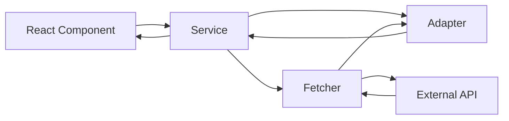

## Introduction

Poke-Nex is built using **Clean Architecture** principles, creating a clear separation of concerns between data fetching, data transformation, and business logic. This architectural pattern ensures maintainability, testability, and scalability as the application grows.

## Why Clean Architecture?

Clean Architecture was chosen for several key reasons:

- **Separation of Concerns**: Each layer has a single, well-defined responsibility
- **Testability**: Business logic can be tested independently of external APIs
- **Maintainability**: Changes to API structure don't cascade through the entire codebase
- **Flexibility**: Easy to swap out data sources (REST to GraphQL, different APIs, etc.)
- **Type Safety**: TypeScript types are defined at each layer for compile-time safety

## Architecture Layers

The application is structured in three main layers:

<CardGroup cols={3}>
  <Card title="Fetchers" icon="download" color="#ea5777">
    Located in `lib/api/`, these handle raw API communication
  </Card>
  <Card title="Adapters" icon="shuffle" color="#f19066">
    Located in `adapters/`, these transform API data to app models
  </Card>
  <Card title="Services" icon="gears" color="#5f27cd">
    Located in `services/`, these contain business logic and orchestration
  </Card>
</CardGroup>

### Layer 1: Fetchers (Data Access)

**Location**: `src/lib/api/pokemon.api.ts`

**Responsibility**: Make HTTP requests to external APIs and return raw API responses.

```typescript
// Example: Fetching raw Pokemon data
export const fetchPokemonByID = async (
  slug: string,
  extended = false
): Promise<ApiPokemonResponse> => {
  const baseResponse = await fetch(`${BASE_URL}/pokemon/${slug}`, {
    next: { revalidate: 604800 },
  })
  if (!baseResponse.ok) {
    throw new ApiError(
      `[API.ERROR] The Pokémon "${slug}" could not be obtained.`,
      baseResponse.status,
      '[fetchPokemonByID.base]'
    )
  }
  return await baseResponse.json()
}
```

<Info>
Fetchers work directly with API types (`ApiPokemonResponse`) and handle HTTP-level concerns like caching, error status codes, and retries.
</Info>

### Layer 2: Adapters (Data Transformation)

**Location**: `src/adapters/pokemon-detail.adapter.ts`, `src/adapters/pokemon-summary.adapter.ts`

**Responsibility**: Transform raw API data structures into clean, application-specific models.

```typescript
// Example: Transforming API response to app model
export const adaptPokemon = ({
  id,
  name,
  height,
  weight,
  types,
  sprites,
  // ... more API fields
}: ApiPokemonResponse): PokemonDetail => {
  return {
    id,
    name,
    height: height / 10,  // Convert to correct units
    weight: weight / 10,
    types: mapTypes(types),  // Transform type structure
    // ... clean, normalized data
  }
}
```

<Info>
Adapters convert from `ApiPokemonResponse` (what the API returns) to `PokemonDetail` (what the app uses). They handle data normalization, unit conversion, and field mapping.
</Info>

### Layer 3: Services (Business Logic)

**Location**: `src/services/pokemon.service.ts`

**Responsibility**: Orchestrate data fetching and transformation, handle errors, and provide a clean API for components.

```typescript
// Example: Service method combining fetcher + adapter
export const getPokemonDetail = async (
  slug: string,
  extended: boolean = true
): Promise<ServiceResponse<PokemonDetail>> => {
  try {
    if (!slug) throw new Error('The Pokémon slug or ID is required.')
    const pokemonData = await fetchPokemonByID(slug, extended)
    if (!pokemonData) throw new ApiError('Pokémon data is null')
    return { data: adaptPokemon(pokemonData), error: null }
  } catch (error) {
    const fault = handleServiceError(error, '[getPokemonDetail]')
    return { data: null, error: fault }
  }
}
```

<Info>
Services return a standardized `ServiceResponse<T>` type that always includes both `data` and `error` fields, making error handling predictable.
</Info>

## Data Flow Overview



1. **Component** calls a service method (e.g., `getPokemonDetail()`)
2. **Service** calls the appropriate fetcher (e.g., `fetchPokemonByID()`)
3. **Fetcher** makes HTTP request and returns raw API data
4. **Service** passes raw data through adapter (e.g., `adaptPokemon()`)
5. **Adapter** transforms data to application model
6. **Service** returns normalized data to component

<Tip>
See the [Data Flow](/architecture/data-flow) page for a complete walkthrough with real code examples.
</Tip>

## Type Safety

Each layer has its own TypeScript types:

```typescript
// API Layer Types (api.types.ts)
type ApiPokemonResponse = { /* raw API structure */ }

// Application Layer Types (pokemon.types.ts)
interface PokemonDetail { /* clean app structure */ }

// Service Layer Types (service.types.ts)
type ServiceResponse<T> = 
  | { data: T; error: null }
  | { data: null; error: DisplayError }
```

This ensures type safety at compile time and makes it impossible to accidentally use raw API data in components.

## Benefits in Practice

<CardGroup cols={2}>
  <Card title="Easy Testing" icon="vial">
    Mock services without touching real APIs. Test adapters with fixture data.
  </Card>
  <Card title="API Changes Isolated" icon="shield">
    When PokeAPI changes, only fetchers and adapters need updates.
  </Card>
  <Card title="Multiple Data Sources" icon="database">
    Easily support both REST and GraphQL APIs (see `fetchPokemonListGQL`)
  </Card>
  <Card title="Consistent Error Handling" icon="triangle-exclamation">
    All errors normalized to `DisplayError` format for predictable UI handling
  </Card>
</CardGroup>

## Next Steps

<CardGroup cols={2}>
  <Card title="Clean Architecture Details" icon="layer-group" href="/architecture/clean-architecture">
    Deep dive into each layer with complete code examples
  </Card>
  <Card title="Data Flow" icon="diagram-project" href="/architecture/data-flow">
    Trace a request from component to API and back
  </Card>
</CardGroup>